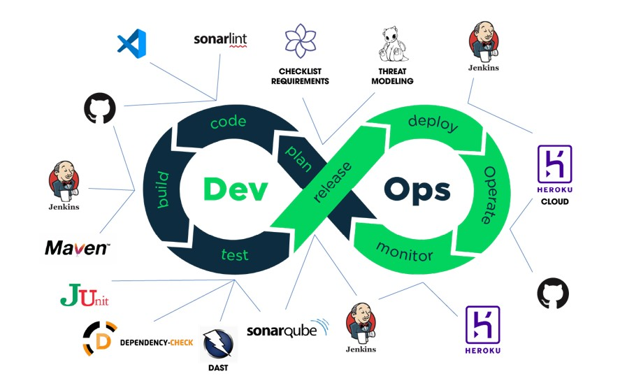
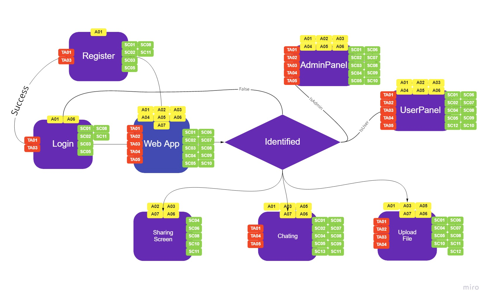
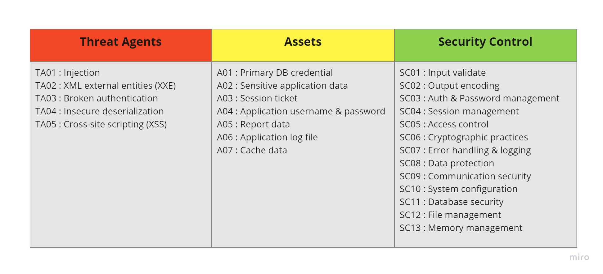

# Milestone - Learnathon Java Web App Demo Project
Learnathon is project which used to demo SDLC/DevSecOps cycle

[You can view demo here!](https://youtu.be/W9Mrn4KiaBE)

## About DevSecOps cycle
I use Jenkins for through out the process and all job is handled on it.

### Plan & Analysist Stage
- Prepare the checklist with [Security Knowledge Framework](https://www.securityknowledgeframework.org/)
- Value security & risk of blueprint using Miro App to design threat modeling

### Coding Stage
I use:
- VS Code: IDE for dev
- SonarLint: Application of Sonar ecosystem to improve code quality, code pattern and security code
- Github: Store & archive sources, prepare for next stage
- Maven: Build java project

### Test & Scan Stage
In this stage, I will use 2 type of scanning - SAST & DAST scan for this project:
- SAST (Static Application Security Testing): OWASP Dependency-Check and SonarQube scan
- DAST (Dynamic Application Security Testing): OWASP ZAP Proxy

### Release & Deploy Stage
- Jenkins Tool
- Heroku Cloud: for web app deploy and monitoring

## Threat Modeling

