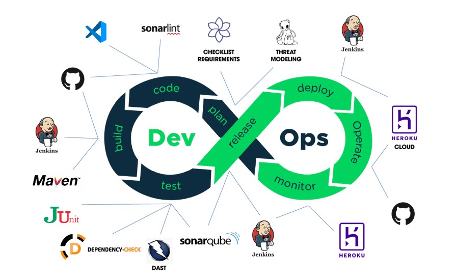
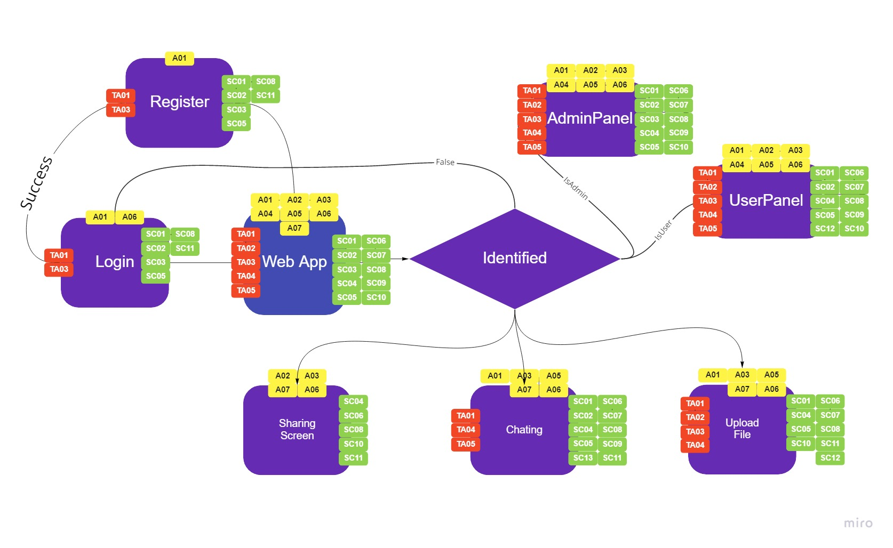
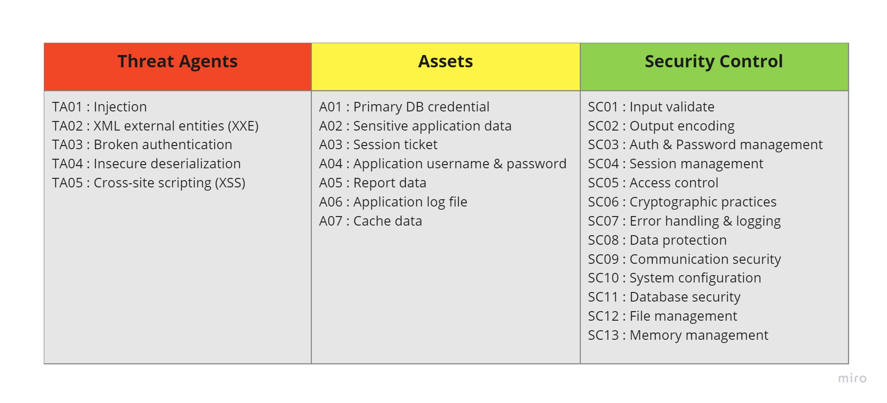

# Milestone: Learnathon SDLC/DevSecOps Demo Project

Welcome to the Milestone project, designed to demonstrate the Software Development Life Cycle (SDLC) with integrated DevSecOps practices. This project illustrates how to secure a Java web application using modern tools and automation pipelines.

---

## 🚀 Live Demo

- [Video Demonstration](https://youtu.be/W9Mrn4KiaBE)
- [Interactive Demo with XSS Bug](http://demo-learnathon.herokuapp.com/)  
  *(Explore a deliberately vulnerable feature to understand common security pitfalls.)*

---

## 🔄 DevSecOps Lifecycle Overview

This project leverages Jenkins to orchestrate the entire DevSecOps process, ensuring each stage is automated and secure.

### 1. Plan & Analysis
- Utilize [Security Knowledge Framework](https://www.securityknowledgeframework.org/) for a comprehensive security checklist.
- Conduct risk assessment and threat modeling using Miro for blueprint design.

### 2. Coding
- **Development Tools**: Visual Studio Code
- **Code Quality**: SonarLint for static analysis and secure coding patterns
- **Version Control**: GitHub for source management and collaboration
- **Build System**: Maven for project compilation and dependency management

### 3. Testing & Scanning
Two types of security scans are integrated:
- **SAST (Static Application Security Testing)**
  - OWASP Dependency-Check
  - SonarQube Analysis
- **DAST (Dynamic Application Security Testing)**
  - OWASP ZAP Proxy

### 4. Release & Deployment
- **CI/CD Automation**: Jenkins
- **Cloud Deployment**: Heroku for application hosting and monitoring

---

## 🔍 Threat Modeling

Security is a core focus, with detailed threat modeling and risk assessment included.

---

## 📊 Project Information

---

Feel free to explore the demo, review the DevSecOps pipeline, and use this project as a reference for securing your own Java web applications!